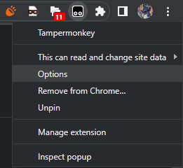
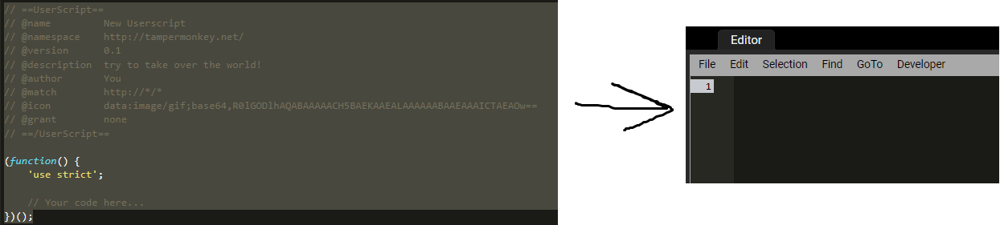
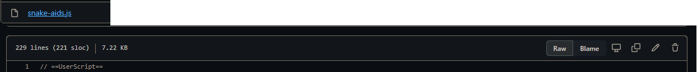

# everfi-sucks
i hate this stupid financial literaccy course so here's a tampermonkey script to make it less horrible

all it does is enable `a` tag buttons, and add a button at the bottom of the screen to enable disabled `button`s 
also now it lets you skip pages.

# how to install the script

requires: Tampermonkey 
[Chrome / Edge](https://chrome.google.com/webstore/detail/tampermonkey/dhdgffkkebhmkfjojejmpbldmpobfkfo?hl=en) - [Firefox](https://addons.mozilla.org/en-US/firefox/addon/tampermonkey/) 
 
once the extension is installed, right click it, then click options 
 
then, click the `[+]` to create a script 
 
press `Ctrl`+`A`, then press `Backspace` to clear the preset script 
 
then, navigate to the `snake-aids.js` file, above the script click `Raw` 
 
after that, press `Ctrl`+`A`, then `Ctrl`+`C` to copy the whole script 
once copied, navigate back to the new userscript tab, then press `Ctrl`+`V` to paste the script in 
now that it's pasted in, you may press `Ctrl`+`S` to save the script 
to test that you did it correctly, either refresh your existing EVERFI tab, or open a new tab and navigate to EVERFI 
 
